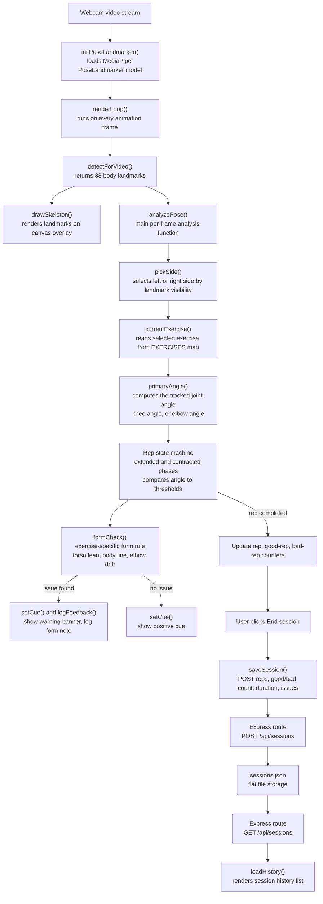

# Posture Check - Workout Form Tracker

Real-time workout posture detection in the browser. MediaPipe Pose runs
client-side on the webcam feed to detect body landmarks; joint-angle
calculations turn those landmarks into rep counting and live form feedback
for squats, push-ups, and bicep curls. An Express backend serves the app and
stores a short history of past sessions.

## High-level design

All pose detection and form analysis happens in the browser. The backend
never receives video - only a small JSON summary once a session ends.



### What each function does

| Function | File | Purpose |
|---|---|---|
| `initPoseLandmarker()` | script.js | Loads the MediaPipe pose model on page load |
| `startCamera()` / `stopCamera()` | script.js | Starts and stops the webcam stream |
| `renderLoop()` | script.js | Main loop; runs pose detection on every frame |
| `pickSide()` | script.js | Chooses the more visible body side (left or right) for angle calculations |
| `angleAt()` | script.js | Calculates the angle at a joint from three landmark points |
| `torsoLeanAngle()` | script.js | Calculates how far the torso leans from vertical |
| `EXERCISES` | script.js | Configuration for each exercise: tracked angle, rep thresholds, cue text, and form rule |
| `analyzePose()` | script.js | Runs each frame; drives rep counting and form checking |
| `drawSkeleton()` | script.js | Draws the landmark skeleton on the canvas overlay |
| `saveSession()` / `loadHistory()` | script.js | Sends a finished session to the backend and refreshes the history list |
| `server.js` routes | server.js | `GET/POST /api/sessions` to store and retrieve session summaries |

### Exercises and what is tracked

| Exercise | Tracked angle | Form check |
|---|---|---|
| Squat | Hip-knee-ankle | Forward lean, excessive depth |
| Push-up | Shoulder-elbow-wrist | Hips sagging or piking (shoulder-hip-ankle line) |
| Bicep curl | Shoulder-elbow-wrist | Upper arm swinging away from torso |

## Setup

```bash
npm install
npm start
```

Open `http://localhost:3000` in a modern browser (Chrome or Edge
recommended) and allow camera access when prompted.

The MediaPipe model and runtime load from a CDN on first use, so an internet
connection is required the first time the page loads.

## Usage

1. Select an exercise from the dropdown: squat, push-up, or bicep curl.
2. Click Start session and position yourself so the relevant joints are
   visible to the camera.
3. Perform reps. The counter increments on each full contract-extend cycle.
4. The banner below the video shows live form cues; the form notes panel
   logs a running list of flagged issues.
5. Click End session to save the results to session history.

The exercise dropdown is locked while a session is running.

## Tuning detection thresholds

Each exercise's rules are defined in the `EXERCISES` object in
`public/script.js`:

```js
squat: {
  contractedThreshold: 100, // knee angle below this = in the squat
  extendedThreshold: 160,   // knee angle above this = standing
  formCheck: (j, primaryAngle, phase) => { /* lean and depth checks */ }
}
```

These threshold values are starting points, not values measured from real
reps. Expect to adjust them based on camera angle, body proportions, and
what counts as correct form for each exercise.

## Extending the project

- To add a new exercise, add an entry to the `EXERCISES` object with a
  `primaryAngle` function, rep thresholds, cue text, and an optional
  `formCheck` function, then add a matching option to the exercise dropdown
  in `index.html`.
- To use persistent storage instead of a flat file, replace the read/write
  logic in `server.js` with a database such as SQLite or MongoDB.
- To support multiple users, add authentication middleware and scope
  sessions by user ID.

## Project structure

```
posture-app/
  server.js              Express server and sessions API
  package.json
  sessions.json           created automatically on first saved session
  public/
    index.html            page structure
    style.css              visual styling
    script.js               webcam capture, pose detection, rep and form logic
```
